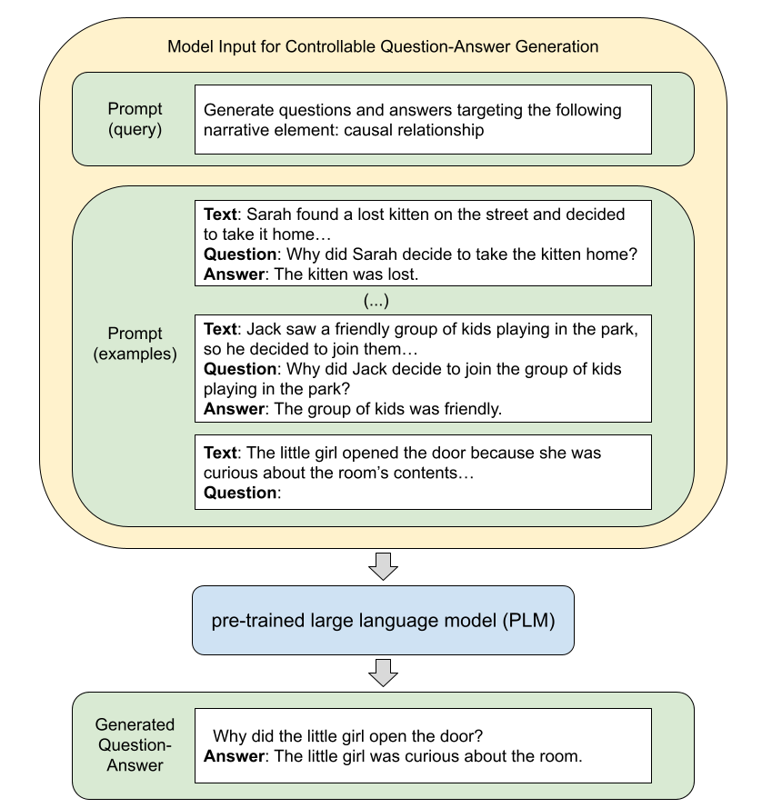

# On Few-Shot Prompting for Controllable Question-Answer Generation in Narrative Comprehension
===============

Sample source code for our [CSEDU 2024](https://csedu.scitevents.org/) paper: [On Few-Shot Prompting for Controllable Question-Answer Generation in Narrative Comprehension
](https://arxiv.org/abs/2404.02800)

**Abstract:** Question Generation aims to automatically generate questions based on a given input provided as context. A controllable question generation scheme focuses on generating questions with specific attributes, allowing better control. In this study, we propose a few-shot prompting strategy for controlling the generation of question-answer pairs from children's narrative texts. We aim to control two attributes: the question's explicitness and underlying narrative elements. With empirical evaluation, we show the effectiveness of controlling the generation process by employing few-shot prompting side by side with a reference model. Our experiments highlight instances where the few-shot strategy surpasses the reference model, particularly in scenarios such as semantic closeness evaluation and the diversity and coherency of question-answer pairs. However, these improvements are not always statistically significant.

**Authors:** Bernardo Leite, Henrique Lopes Cardoso

## Illustrative Example

## Main Features
* Training, inference and evaluation scripts for controllable QG
* Fine-tuned QG T5 models for controllable QG (**to be done**)

## Code for few-shot prompting
TODO

## Code for fine-tuning
The base code for fine-tuning is based on a [previous implementation](https://github.com/bernardoleite/question-generation-control).
   
## Contact
* Bernardo Leite, bernardo.leite@fe.up.pt
* Henrique Lopes Cardoso, hlc@fe.up.pt
